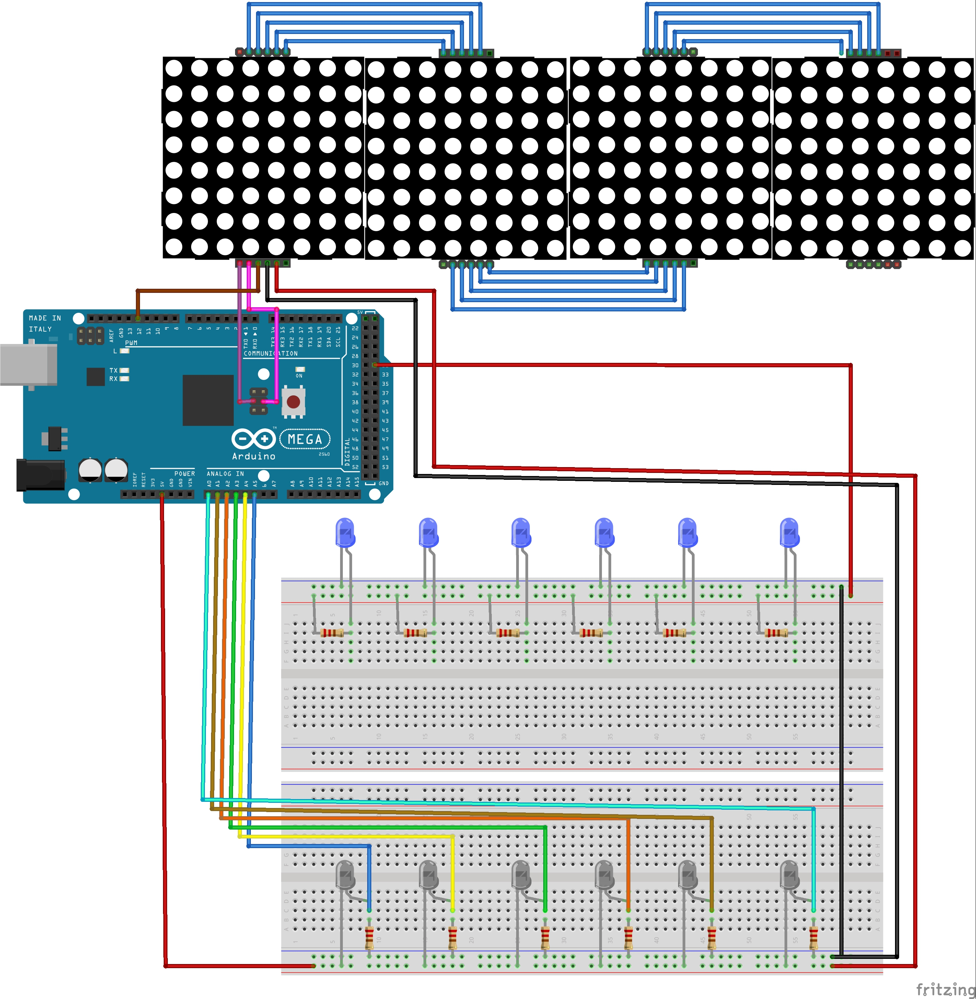

# Ajolote: simulación de un organismo

## Descripción general
La finalidad de la realización de este proyecto es tener un acercamiento inicial a la simulación de comportamientos de organismos en un ambiente delimitado, de esta forma la matriz funge como un contenedor para el organismo.

Es parte de la intención el comprender la forma en que se entiende el comportamiento de un ser vivo y las interacciones que se esperan de él.

## Descripción Física

Ajolote está dividido en dos secciones, la conjunción de matriz de pantallas y la red de sensores infrarrojos.

## Sensores infrarrojos
Los emisores y receptores infrarrojos se encuentran en secciones separadas, la parte de los receptores se colocó en una protoboard con jumpers dirigidos a los pines analógicos `A0` a `A5`.

Los emisores se conectaron en una red separada, directamente hacia el pin `31`, con la finalidad de controlar el flujo de energía durante la calibración inicial.

Los emisores y receptores se encuentran colocados a intervalos equivalentes en posiciones opuestas de forma paralela a la matriz de LED, de esta forma, la interrupción del contacto de uno genera un método para encender un LED específico en una posición aleatoria correspondiente en la matriz.

## Matrices LED
Las matrices led, conectadas de forma individual a un chip MAX7219 se encuentran conectadas a los puertos `MOSI` y `SCK` de la interfaz `SPI`, además se interconectan en cascada en forma horizontal, para obtener una matriz de `8 x 31` LED.

## Descripción lógica

### Simulación del organismo
El organismo simulado tiene movimientos aleatorios, tanto la posición como la velocidad a la que se moverá se generan aleatoriamente, para simular una movimiento orgánico se emplea una fórmula de easing con la finalidad de suavizar la reducción de velocidad.

Los movimientos se llevan a cabo en pasos completos de un punto A al B, no se interrumpen y son continuos, es decir, la última posición se mantiene y desde esta se inicia el nuevo ciclo de caminado. La finalidad de esto es hacer una simulación de un organismo desplazándose en un ambiente cerrado.

### Interacción
Para interactuar con el organismo se emplea la red de sensores infrarrojos, la interrupción de la comunicación de los mismos ejecuta una función para encender un LED específico en la matriz, la posición horizontal del mismo está en relación con la ubicación del sensor con respecto a la matriz; la posición vertical es aleatoria.

El punto encendido simula comida, misma que el organismo persigue a gran velocidad.
